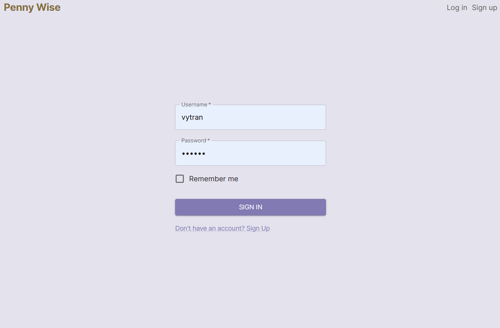
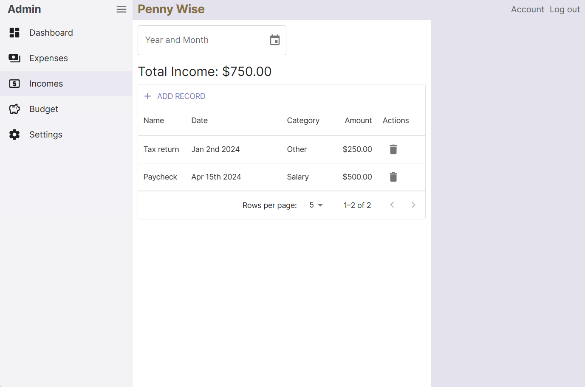

# Personal Financial Tracker

This Personal Financial Tracker is a comprehensive financial tracking web application built using the MERN (MongoDB, Express.js, React.js, Node.js) stack. It allows users to manage their expenses, incomes, and budgets while providing insights into their financial activities. The application leverages modern technologies such as TypeScript, React, MongoDB, Express.js, and JWT Authentication to deliver a robust and secure user experience.

## Purpose of the application

The purpose of this project is twofold:

- **Personal Need**: The application serves as a personal financial management tool for the developer, aiding in tracking expenses, managing budgets, and gaining insights into financial habits.
- **Learning and Skill Expansion**: Building this application provides an opportunity to expand knowledge and expertise in developing web applications using modern technologies such as TypeScript, React, and MongoDB. Additionally, implementing features like authentication and data visualization with Chart.js contributes to skill enhancement.

This project aims to develop a feature-rich financial tracking application with advanced functionalities, including:

- **Data Integrity and Reliability**: Establishing secure connections between the frontend and backend layers, applying best practices in Node.js and MongoDB database management to maintain data integrity and reliability.
- **Data Security**: In an era where data security is crucial, developing applications with robust security measures is considered a best practice. This project aims to incorporate industry-standard security practices, such as JWT Authentication and secure connections, to ensure the safety and privacy of user data.

## Features

- **Expense Tracking**: Users can log their expenses, categorize them, and view detailed summaries.
- **Income Tracking**: Users can log their incomes, categorize them, and view detailed summaries.
- **Budget Management**: Users can create, update, and delete budgets, empowering them to allocate their funds effectively.
- **Authentication and Authorization**: Secure user authentication and authorization using JWT Authentication, ensuring data privacy and access control.
  **Dashboard**: Interactive dashboard displaying charts and balance summaries for quick insights into financial health.

## Technologies

- Frontend:
  - React.js
  - TypeScript
  - Redux (for state management)
  - Chart.js (for data visualization)
  - Axios (for API requests)
- Backend:
  - Node.js
  - Express.js
  - MongoDB
  - JWT Authentication

## Documentation

Work in progress..

## Environment Variables

Work in progress..

## Badges

## Authors

This project was created by [@vytran](https://www.github.com/vytran1805)

## Screenshots

**Login page**

**Dashboard**

**Income page**

